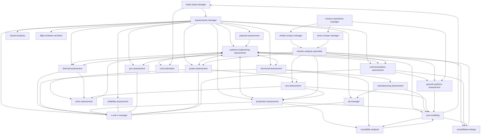

# Space Engineering Skills for AI Agents

> [!IMPORTANT]
> A comprehensive collection of specialized AI agent skills for space engineering. Built for aerospace engineers, mission designers, and founders who want AI coding agents (like Claude Code, Cursor, Windsurf, or OpenAI) to help with systems engineering, structural analysis, thermal modeling, propulsion, and reliability.

Built by [LunCo](https://lunco.space). Need hands-on help with space mission design or AI agent integration? [Get in touch](mailto:contact@lunco.space).

---

## 🚀 Quick Start

If you have `npx` installed, you can add all skills to your project in one command:

```bash
# Initialize all space engineering skills in your project
npx skills add LunCoSim/space-engineering-skills
```

## 🧠 What are Skills?

Skills are markdown files (`SKILL.md`) that give AI agents specialized knowledge and workflows for specific tasks. When you add these to your project, your agent can recognize when you're working on a space engineering task and apply the right frameworks, standards, and best practices.

## 📋 Shared Conventions

All skills follow a shared protocol defined in [CONVENTIONS.md](CONVENTIONS.md). This covers:
- **Clarification-first rule** — skills ask about mission type, target body, standards, and design phase before producing analysis
- **Data flow** — standardized file locations (`/requirements/`, `/analysis/[skill-name]/`) for multi-agent workflows
- **Phase-gate mapping** — which skills are relevant at which design phase (A through D)
- **Conflict escalation** — how budget overruns and inconsistencies are handled
- **Output format** — human-readable Markdown with traffic-light status indicators

## 🔗 How Skills Work Together

Skills reference each other and build on shared context. `requirements-manager` is the foundation, `trade-study-manager` shapes the architecture, domain skills perform detailed analysis, and `v-and-v-manager` closes the loop.



---

## 🛠 Available Skills

| Category | Skill | Summary |
| :--- | :--- | :--- |
| **Architecture** | [trade-study-manager](skills/trade-study-manager) | Structured trade studies, Figures of Merit, decision analysis. |
| **Management** | [requirements-manager](skills/requirements-manager) | Define, update, and trace system requirements. |
| **Management** | [v-and-v-manager](skills/v-and-v-manager) | Verification & Validation with compliance tracking. |
| **Management** | [systems-engineering-assessment](skills/systems-engineering-assessment) | Top-level budget integrator and conflict resolver. |
| **Management** | [hazard-analysis](skills/hazard-analysis) | Top-down safety, risk indexing, and controls. |
| **Operations** | [orbital-conops-manager](skills/orbital-conops-manager) | Mission phases, operational modes, and disposal planning. |
| **Operations** | [lunar-conops-manager](skills/lunar-conops-manager) | Lunar surface ops, traverse planning, and day/night cycling. |
| **Operations** | [mission-operations-manager](skills/mission-operations-manager) | T&C definitions, pass planning, and anomaly resolution. |
| **Operations** | [ait-manager](skills/ait-manager) | AIT planning, model philosophy, GSE, and cleanliness. |
| **Programmatic** | [cost-estimation](skills/cost-estimation) | Parametric cost modeling, CERs, cost-risk S-curves, design-to-cost. |
| **Analysis** | [payload-assessment](skills/payload-assessment) | Instrument sizing, data rate derivation, bus requirements flowdown. |
| **Analysis** | [mission-analysis-specialist](skills/mission-analysis-specialist) | Astrodynamics, trajectory design, and delta-v budgets. |
| **Analysis** | [thermal-assessment](skills/thermal-assessment) | Heat balance, radiator sizing, and surface properties. |
| **Analysis** | [structural-assessment](skills/structural-assessment) | Mass properties, CG, MOI, and Margins of Safety. |
| **Analysis** | [propulsion-assessment](skills/propulsion-assessment) | Chemical & electric propulsion sizing, tank design. |
| **Analysis** | [reliability-assessment](skills/reliability-assessment) | FMECA, TID, parts derating, and mission reliability. |
| **Analysis** | [gnc-assessment](skills/gnc-assessment) | Pointing budgets, actuator sizing, attitude modes. |
| **Analysis** | [power-assessment](skills/power-assessment) | Solar array/battery sizing, alternative power sources. |
| **Analysis** | [communications-assessment](skills/communications-assessment) | RF link budgets, data volume, and ground segment. |
| **Analysis** | [flight-software-architect](skills/flight-software-architect) | FSW architecture, OBC selection, FDIR, CI/CD, and simulation-in-the-loop. |
| **Cost & Production** | [cost-modeling](skills/cost-modeling) | Parametric cost estimation, CERs, launch costs, lifecycle costing. |
| **Cost & Production** | [manufacturing-assessment](skills/manufacturing-assessment) | DFM/DFA, make-vs-buy, production rate, and quality planning. |
| **Cost & Production** | [reusability-analysis](skills/reusability-analysis) | Recovery systems, refurbishment cost, reuse degradation, flight-rate economics. |
| **Human Spaceflight** | [eclss-assessment](skills/eclss-assessment) | Life support: O₂, CO₂, water recovery, habitable volume. |
| **Human Spaceflight** | [isru-assessment](skills/isru-assessment) | In-situ resource utilization: regolith processing, propellant production. |
| **Constellation** | [constellation-design](skills/constellation-design) | Walker patterns, coverage analysis, ISLs, deployment strategy. |
| **Ground Segment** | [ground-systems-assessment](skills/ground-systems-assessment) | Mission control, ground stations, launch facilities, GSE. |

---

## 📥 Installation

### Option 1: CLI Install (Recommended)
Use [npx skills](https://github.com/vercel-labs/skills) to install skills directly:

```bash
# Install all skills
npx skills add LunCoSim/space-engineering-skills

# Install specific skills
npx skills add LunCoSim/space-engineering-skills --skill requirements-manager thermal-assessment
```

### Option 2: Clone and Copy
Clone the repository and copy the skills you need into your project's `.agents/skills` or `skills` folder.

```bash
git clone https://github.com/LunCoSim/space-engineering-skills.git
cp -r space-engineering-skills/skills/[skill-name] your-project/.agents/skills/
```

## 📖 Usage

Once installed, your AI agent will automatically detect the skills and use them when you ask tasks related to their specialized knowledge.

**Example Prompts:**
- *"Create a new requirement for the power system that specifies 100W peak power."*
- *"Perform a preliminary thermal assessment for a 12U CubeSat in LEO."*
- *"Run a trade study comparing chemical vs electric propulsion for our lunar orbiter."*
- *"Size the optical payload for 5m GSD from a 500km orbit."*

---

## 🤝 Contributing
Found a way to improve a skill or have a new one to add? [Open a PR](https://github.com/LunCoSim/space-engineering-skills/pulls).

## 📄 License
This project is licensed under the Apache 2.0 License. See the [LICENSE](LICENSE) file for more details.
