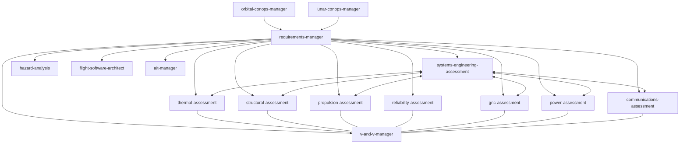

# Space Engineering Skills for AI Agents

> [!IMPORTANT]
> A comprehensive collection of specialized AI agent skills for space engineering. Built for aerospace engineers, mission designers, and founders who want AI coding agents (like Claude Code, Cursor, Windsurf, or OpenAI) to help with systems engineering, structural analysis, thermal modeling, propulsion, and reliability.

Built by [LunCo](https://lunco.space). Need hands-on help with space mission design or AI agent integration? [Get in touch](mailto:contact@lunco.space).

---

## 🚀 Quick Start

If you have `npx` installed, you can add all skills to your project in one command:

```bash
# Initialize all space engineering skills in your project
npx skills add LunCoSim/space-engineering-skills
```

## 🧠 What are Skills?

Skills are markdown files (`SKILL.md`) that give AI agents specialized knowledge and workflows for specific tasks. When you add these to your project, your agent can recognize when you're working on a space engineering task and apply the right frameworks, standards, and best practices.

## 🔗 How Skills Work Together

Skills reference each other and build on shared context. The `requirements-manager` skill is the foundation — every other skill checks it first to understand your system requirements, constraints, and verification criteria before doing anything.



---

## 🛠 Available Skills

| Category | Skill | Summary |
| :--- | :--- | :--- |
| **Management** | [requirements-manager](skills/requirements-manager) | Define, update, and trace system requirements in a human-readable format. |
| **Management** | [v-and-v-manager](skills/v-and-v-manager) | Manage Verification and Validation (V&V) by linking assessments to requirements. |
| **Management** | [systems-engineering-assessment](skills/systems-engineering-assessment) | Top-level integrator for mass, power, and link budgets. |
| **Management** | [hazard-analysis](skills/hazard-analysis) | Top-down safety identification, risk indexing, and controls. |
| **Operations** | [orbital-conops-manager](skills/orbital-conops-manager) | Concept of Operations and orbital mechanics for Earth missions. |
| **Operations** | [lunar-conops-manager](skills/lunar-conops-manager) | Surface operations, traverse planning, and 14-day lunar cycle management. |
| **Operations** | [mission-operations-manager](skills/mission-operations-manager) | T&C definitions, pass planning, and anomaly resolution. |
| **Operations** | [ait-manager](skills/ait-manager) | Assembly, Integration, and Test planning and GSE requirements. |
| **Analysis** | [mission-analysis-specialist](skills/mission-analysis-specialist) | Astrodynamics, trajectory design, and delta-v budgets. |
| **Analysis** | [thermal-assessment](skills/thermal-assessment) | Heat balance, radiator sizing, and MLI modeling. |
| **Analysis** | [structural-assessment](skills/structural-assessment) | Mass properties, CG, MOI, and Margins of Safety analysis. |
| **Analysis** | [propulsion-assessment](skills/propulsion-assessment) | Delta-V requirements, propellant sizing, and T/W ratios. |
| **Analysis** | [reliability-assessment](skills/reliability-assessment) | FMECA, TID, and mission life probability modeling. |
| **Analysis** | [gnc-assessment](skills/gnc-assessment) | Pointing budgets, actuator sizing (wheels/rods), and sensor selection. |
| **Analysis** | [power-assessment](skills/power-assessment) | Solar array BOL/EOL sizing and battery DoD analysis. |
| **Analysis** | [communications-assessment](skills/communications-assessment) | RF link budget analysis and data volume assessments. |
| **Analysis** | [flight-software-architect](skills/flight-software-architect) | FSW architecture, processor sizing, and FDIR logic. |

---

## 📥 Installation

### Option 1: CLI Install (Recommended)
Use [npx skills](https://github.com/vercel-labs/skills) to install skills directly:

```bash
# Install all skills
npx skills add LunCoSim/space-engineering-skills

# Install specific skills
npx skills add LunCoSim/space-engineering-skills --skill requirements-manager thermal-assessment
```

### Option 2: Clone and Copy
Clone the repository and copy the skills you need into your project's `.agents/skills` or `skills` folder.

```bash
git clone https://github.com/LunCoSim/space-engineering-skills.git
cp -r space-engineering-skills/skills/[skill-name] your-project/.agents/skills/
```

## 📖 Usage

Once installed, your AI agent will automatically detect the skills and use them when you ask tasks related to their specialized knowledge.

**Example Prompts:**
- *"Create a new requirement for the power system that specifies 100W peak power."*
- *"Perform a preliminary thermal assessment for a 12U CubeSat in LEO."*
- *"Trace the structural requirements to the CAD verification test plan."*

---

## 🤝 Contributing
Found a way to improve a skill or have a new one to add? [Open a PR](https://github.com/LunCoSim/space-engineering-skills/pulls).

## 📄 License
This project is licensed under the Apache 2.0 License. See the [LICENSE](LICENSE) file for more details.

