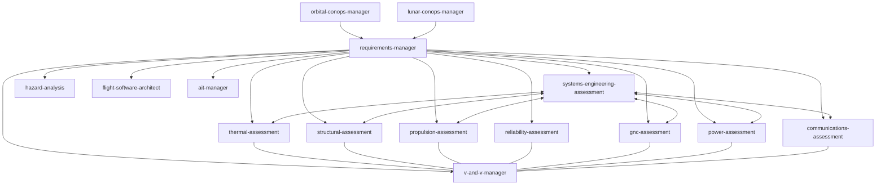

# Space Engineering Skills for AI Agents

A collection of AI agent skills focused on space engineering tasks. Built for aerospace engineers, mission designers, and founders who want AI coding agents to help with systems engineering, structural analysis, thermal modeling, propulsion, and reliability. Works with Claude Code, OpenAI Codex, Cursor, Windsurf, and any agent that supports the [Agent Skills spec](https://agentskills.io).

Built by [LunCo](https://lunco.space). Need hands-on help with space mission design or AI agent integration? [Get in touch](mailto:contact@lunco.space).

---

## What are Skills?
Skills are markdown files that give AI agents specialized knowledge and workflows for specific tasks. When you add these to your project, your agent can recognize when you're working on a space engineering task and apply the right frameworks, standards, and best practices.

## How Skills Work Together
Skills reference each other and build on shared context. The `requirements-manager` skill is the foundation — every other skill checks it first to understand your system requirements, constraints, and verification criteria before doing anything.



Skills cross-reference each other: systems-eng ↔ v-and-v ↔ requirements-manager ↔ orbital-ops ↔ lunar-ops.

## Available Skills
- [requirements-manager](https://github.com/LunCoSim/space-engineering-skills/tree/main/skills/requirements-manager)
- [v-and-v-manager](https://github.com/LunCoSim/space-engineering-skills/tree/main/skills/v-and-v-manager)
- [systems-engineering-assessment](https://github.com/LunCoSim/space-engineering-skills/tree/main/skills/systems-engineering-assessment)
- [thermal-assessment](https://github.com/LunCoSim/space-engineering-skills/tree/main/skills/thermal-assessment)
- [structural-assessment](https://github.com/LunCoSim/space-engineering-skills/tree/main/skills/structural-assessment)
- [propulsion-assessment](https://github.com/LunCoSim/space-engineering-skills/tree/main/skills/propulsion-assessment)
- [reliability-assessment](https://github.com/LunCoSim/space-engineering-skills/tree/main/skills/reliability-assessment)
- [hazard-analysis](https://github.com/LunCoSim/space-engineering-skills/tree/main/skills/hazard-analysis)
- [gnc-assessment](https://github.com/LunCoSim/space-engineering-skills/tree/main/skills/gnc-assessment)
- [power-assessment](https://github.com/LunCoSim/space-engineering-skills/tree/main/skills/power-assessment)
- [communications-assessment](https://github.com/LunCoSim/space-engineering-skills/tree/main/skills/communications-assessment)
- [flight-software-architect](https://github.com/LunCoSim/space-engineering-skills/tree/main/skills/flight-software-architect)
- [ait-manager](https://github.com/LunCoSim/space-engineering-skills/tree/main/skills/ait-manager)
- [orbital-conops-manager](https://github.com/LunCoSim/space-engineering-skills/tree/main/skills/orbital-conops-manager)
- [lunar-conops-manager](https://github.com/LunCoSim/space-engineering-skills/tree/main/skills/lunar-conops-manager)
- [mission-operations-manager](https://github.com/LunCoSim/space-engineering-skills/tree/main/skills/mission-operations-manager)
- [mission-analysis-specialist](https://github.com/LunCoSim/space-engineering-skills/tree/main/skills/mission-analysis-specialist)

## Installation

### Option 1: CLI Install (Recommended)
Use [npx skills](https://github.com/vercel-labs/skills) to install skills directly:

```bash
# Install all skills
npx skills add LunCoSim/space-engineering-skills

# Install specific skills
npx skills add LunCoSim/space-engineering-skills --skill requirements-manager thermal-assessment

# List available skills
npx skills add LunCoSim/space-engineering-skills --list
```

This automatically installs to your `.agents/skills/` directory (and symlinks into `.claude/skills/` for Claude Code compatibility).

### Option 2: Clone and Copy
Clone the repository and copy the skills you need into your project's `.agents/skills` or `skills` folder.

```bash
git clone https://github.com/LunCoSim/space-engineering-skills.git
cp -r space-engineering-skills/skills/[skill-name] your-project/.agents/skills/
```

### Option 3: Git Submodule
Add as a submodule for easy updates:

```bash
git submodule add https://github.com/LunCoSim/space-engineering-skills.git .agents/space-engineering-skills
```

## Usage
Once installed, your AI agent will automatically detect the skills and use them when you ask tasks related to their specialized knowledge.

**Example Prompts:**
- *"Create a new requirement for the power system that specifies 100W peak power."*
- *"Perform a preliminary thermal assessment for a 12U CubeSat in LEO."*
- *"Trace the structural requirements to the CAD verification test plan."*

## Skill Categories

### Systems & Mission Management
- **requirements-manager** - Define, update, and trace system requirements.
- **v-and-v-manager** - Verification and validation tracking.
- **systems-engineering-assessment** - High-level systems trade-offs and integration.
- **orbital-conops-manager** - Concept of Operations for orbital missions.
- **lunar-conops-manager** - Concept of Operations for lunar surface missions.
- **mission-operations-manager** - Mission planning, T&C definition, and anomaly resolution.

### Engineering Analysis
- **mission-analysis-specialist** - Astrodynamics, trajectory design, and delta-v budgets.
- **thermal-assessment** - Thermal modeling and radiator sizing.
- **structural-assessment** - Mass properties, CG, MOI, and margins of safety.
- **propulsion-assessment** - Delta-V calculations and propellant sizing.
- **reliability-assessment** - FMECA, reliability block diagrams, and radiation analysis.
- **hazard-analysis** - Top-down safety identification, risk indexing, and controls.
- **gnc-assessment** - Pointing budgets, actuator sizing, and sensor selection.
- **power-assessment** - Solar array sizing, battery DoD, and power distribution.
- **communications-assessment** - RF link budgets and data volume analysis.
- **flight-software-architect** - FSW architecture, processor sizing, and FDIR logic.
- **ait-manager** - Assembly, Integration, and Test planning and GSE.


## Contributing
Contributions are welcome! Found a way to improve a skill or have a new one to add? [Open a PR](https://github.com/LunCoSim/space-engineering-skills/pulls).

## License
This project is licensed under the Apache 2.0 License. See the [LICENSE](LICENSE) file for more details.

